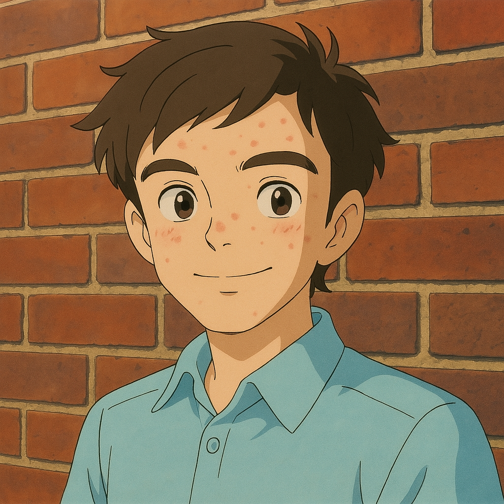
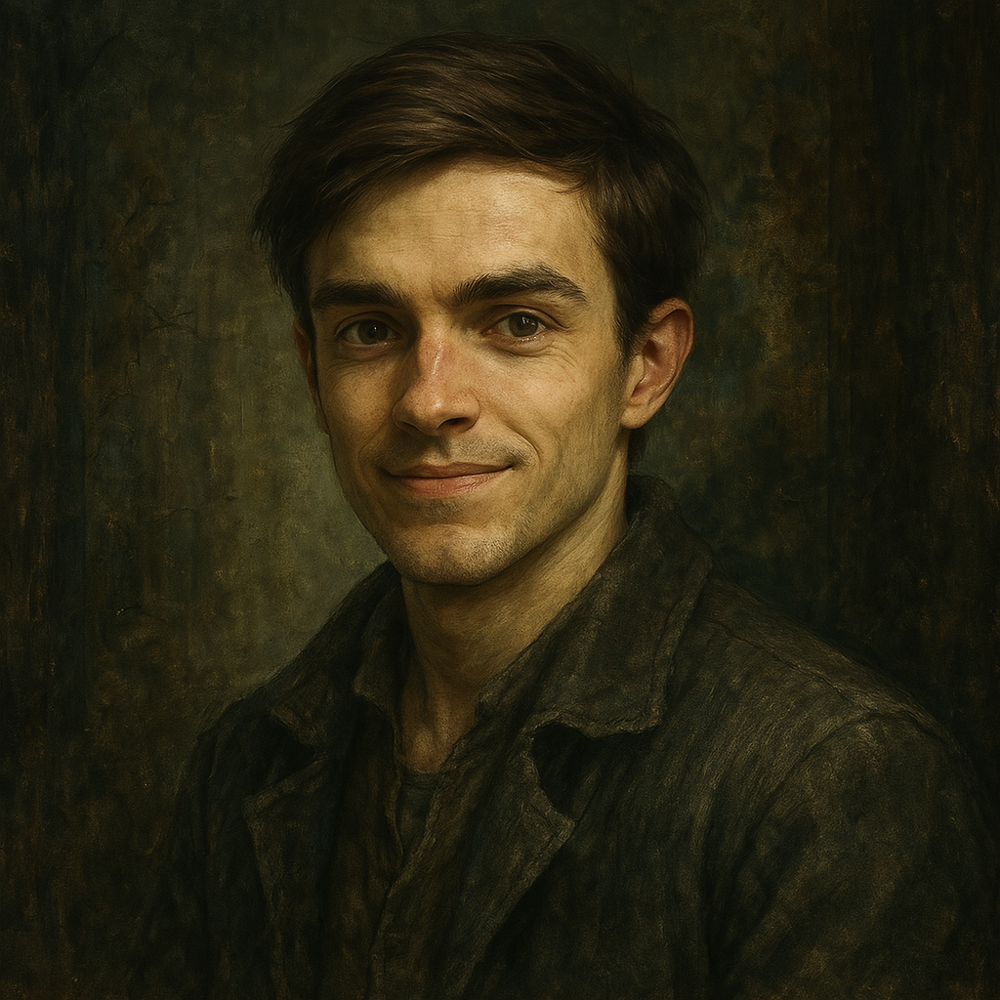
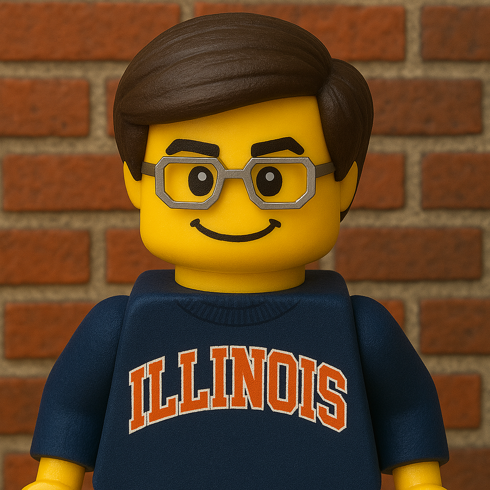
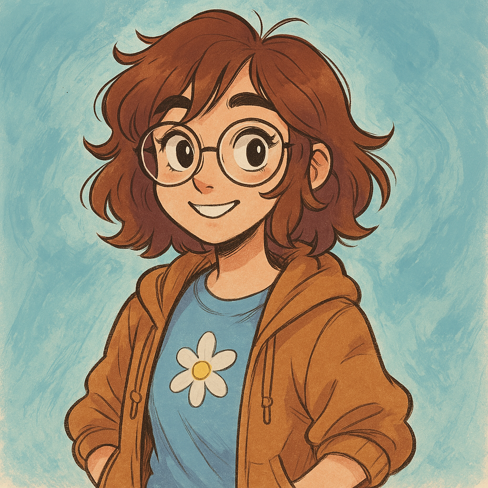
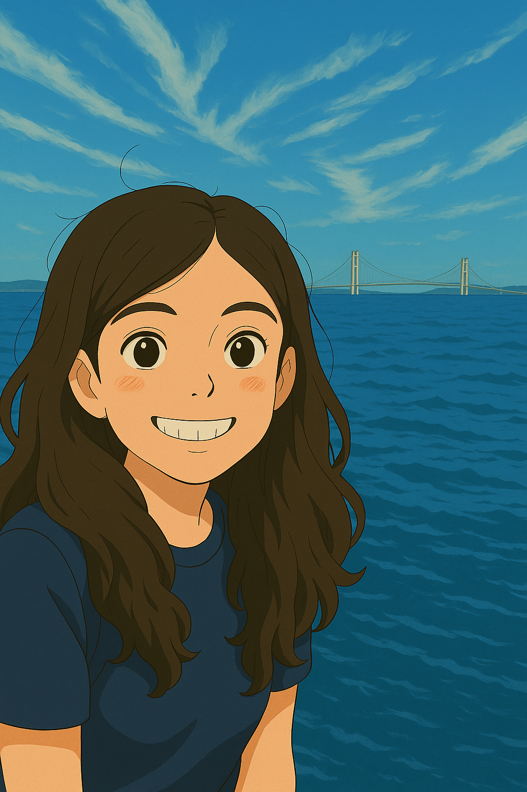
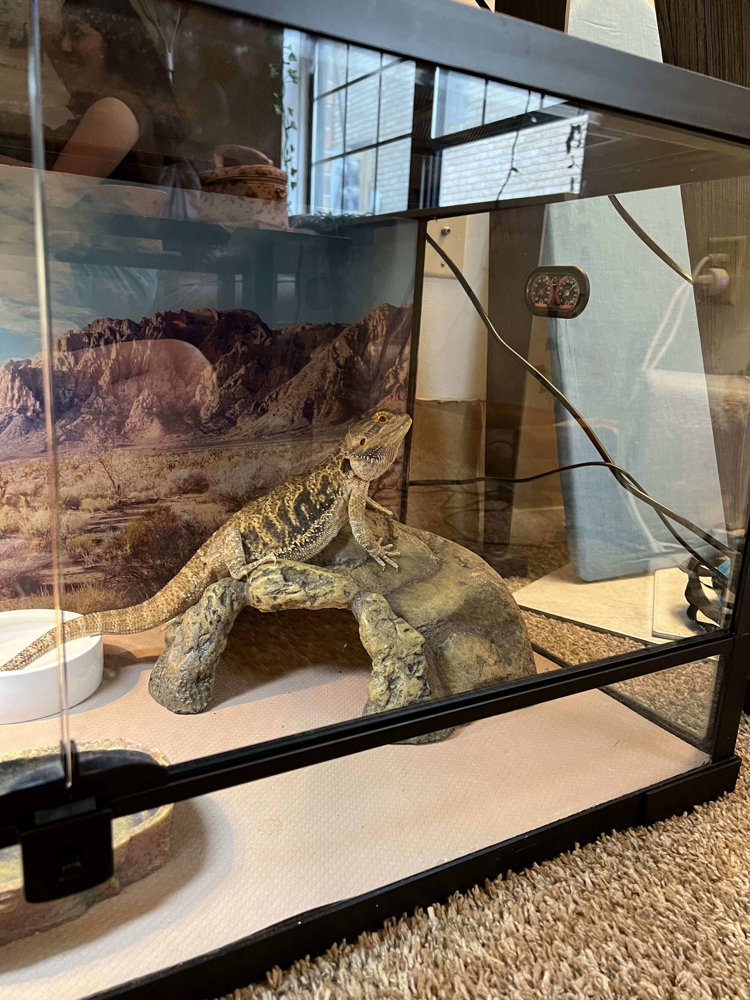
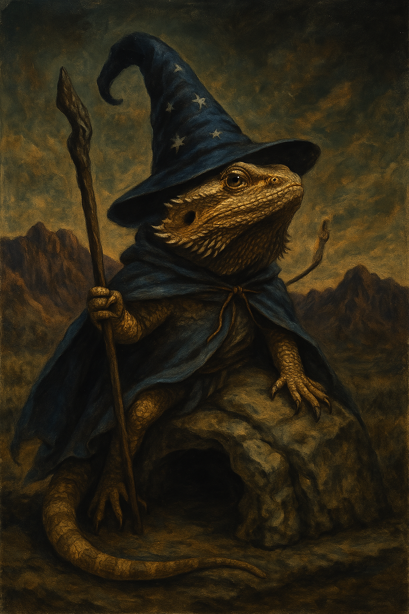
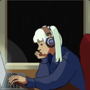
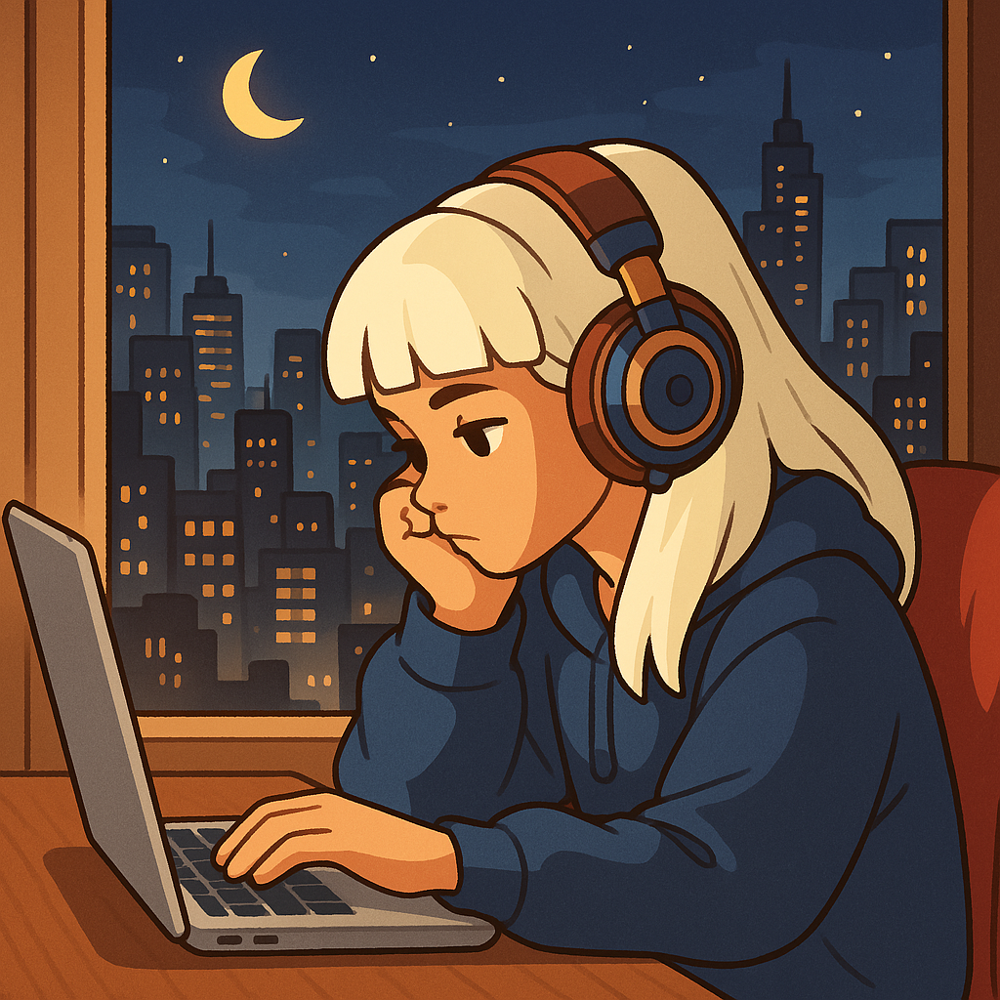
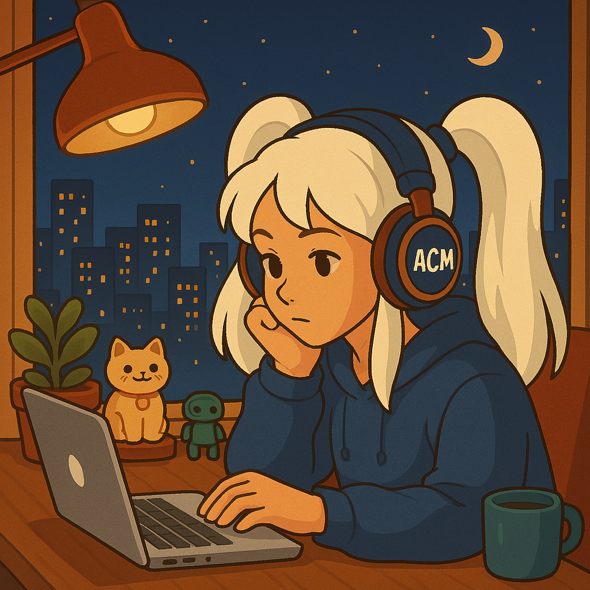

OpenAI's [newest image generation model](https://openai.com/index/introducing-4o-image-generation/) has radically change the landscape of AI-generated images, (*for better, or for worse*).
Admittedly, I've acted like a "kid on Christmas morning" for the past two weeks messing around with this model, and I figured what better than to post my use cases and results.

For the record: this isn't to start some argument about AI art being slop or conflicting with copyright.
I'm of the opinion that, as much as Image generation trivializes the manual work of drawing/painting art, it's by no means a replacement.
Making good art requires a level of creativity and artistic know-how, something that image generators don't provide to the average person.
That is, while the average person can make something slightly better thanks to this new model, trained artists will always have the upper hand, being able to communicate in a language of artistic experience that helps fine-tune the generative process.
Call me optimistic, but we might even start to see more artists incorporating AI tools into their toolbox, such as to reduce time on tedious tasks or to make quick art drafts for clients.

Anyway, here's all the concepts and styles I've tried so far:

    

        
        
Original photo

    

    

        
        
Studio Ghibli (<i>Ah, the acne!</i>)

    

    

        
        
Elden Ring

    

    

        
        
LEGO Minifigure

    

For the next pair of images, I told ChatGPT to generate an image in the style of "the average twitter artist." While I can't be certain that ChatGPT is truly capable of such a style, I did take a liking to its result.

    

        
        
"The average Twitter artist"

    

    

        
        
Me, in said style

    

The very first set of images I did with the new model was to Ghibli-fy my girlfriend, Tegan. All of the small details- hairstrands, the water, the bridge in the background- really sold the idea that this new model was going to be drastically different. Not that the first image was easy- it took a couple different follow-up prompts to fix some small things that stood out too much.

    

        
        <!-- 
Original photo
 -->
    

    

        
        <!-- 
Original photo
 -->
    

Much later, I thought about making her a fun picture we could frame. I ended up turning her pet lizard into a wizard, sitting proudly atop her faux-rock cave.

    

        
    

    

        
    

Long ago, I commissioned an image in the style of [Lofi Girl](https://www.youtube.com/c/LofiGirl) for a Spotify playlist cover. I came back to this image to see how generation would fill in the window behind the student. It also took a couple follow-up prompts to get some of the small details, such as a collegiate club's acronym on the headphones, and twin ponytails.

    

        
        
Original photo

    

    

        
        
Original photo

    

    

        
        
Original photo

    

