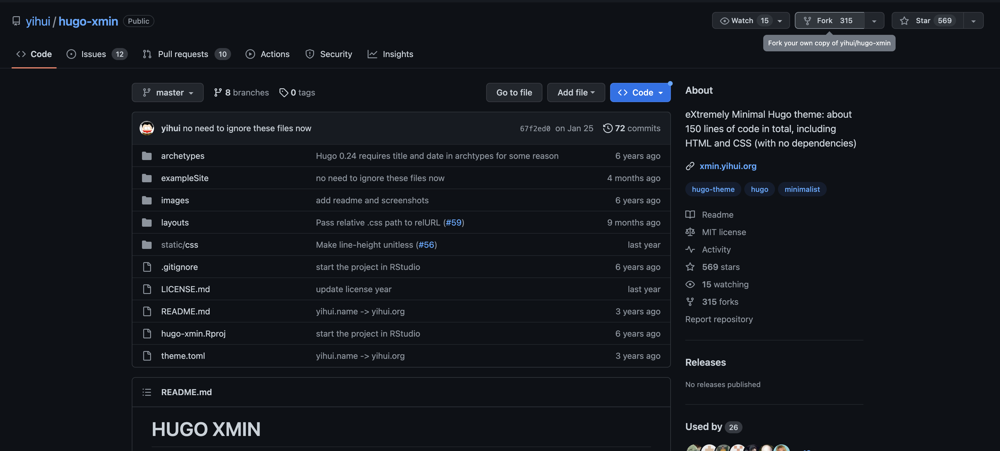

> ⚠️ This article assumes you have a decent understanding about console commands and Git.

# Introduction

I have something rather important to get off my chest:

    I don't like web dev.

<p>There, I said it. I've used plenty of tools in the past, including HTML, CSS and Javascript, yet the idea of making websites never truly stuck. To me, there was always an additional layer of complication that I could never get around. However, there are plenty of tools nowadays that get around the tedium of having to type an endless amount of style and formatting code to make a nice-looking website. This article will hopefully introduce you to a number of tools I've been using to make this website and will hopefully stop you from having to touch <i>javascript</i> 🤮 or do any actual web programming.</p>
<hr>

# Step 1: Build your site

Considering that I only needed to create a static site, I ended up choosing [Hugo](https://gohugo.io/) as it felt relatively intuitive to setup and included good documentation for customizing my site further. The instructions for starting your initial website can be found in their [quick start guide](https://gohugo.io/getting-started/quick-start/), but they can be summarized as such:

1. Install Hugo's extended edition [here](https://gohugo.io/installation/), and Git if you don't already have it.

2. make an open a new directory wherever you want your website files stored locally, which can be done with
    ```bash
    hugo new site <site-folder>
    cd <site-folder>
    ```

3. Initialize a new Git repository with 

        git init

4. Pick a theme (<i>pre-built CSS to forgo actual web-dev</i>) from the [Hugo Themes page](https://themes.gohugo.io/). 

    

    From that theme's Github page, fork your own copy of the theme (<i>this will be important later</i>), grab the forked repo's .git link and run this command:

        git submodule add <theme-link.git> themes/<theme-name>

    This adds your chosen theme as a <i>submodule</i> of your repository, and this will allow you to make changes to your theme's style code later on by commiting and pushing your theme changes to the forked repository:

        cd themes/<theme-name>
        git remote add origin <theme-link.git>

    You can verify that this folder is within your themes directory by running `git remote -v`.

5. Finally, make a `config.yaml` file in your website's root directory, and add the following lines:

        baseurl: http://example.com
        theme: <theme-name>

    Make sure the `<theme-name>` is the same as your submodule, otherwise your theme won't be imported properly by Hugo. Additionally, remember this file for later since you'll want to change the `baseurl` at some point.

Once you've completed these steps, you're ready to begin working on your site! I highly recommend copying all the contents of the `ExampleSite` folder over to your root directory, as this will provide you with a good template to play around with and understand the structure of your Hugo files. Additional information for customizing your site, such as the use of Hugo-specific variables and functions, can be found in their [documentation](https://gohugo.io/documentation/) and are relatively intuitive once you start digging into an `ExampleSite`. 

Otherwise, you'll likely be your site files from scratch. This can be done by either creating a .md file from either an IDE or terminal using the following command:

    (User/website/content:) hugo new <page-name>.md

> Side note: markdown offers a number of tags for organizing or describing your pages. In particular, make sure `draft` is set to **false** when you're ready to publish your website, (otherwise your pages won't appear on the published site.)

As you're making your website's pages, you'll likely want to check what the pages will look like in real-time. This can be done with:

    (User/website:) hugo server

This command builds your pages and runs your website locally. Editing and re-saving files while your website is running locally allows you to see immediate changes to your pages.

Lastly, once you have your first draft of your website ready to publish, you can run:

    (User/website:) hugo

This command compiles all your Hugo files together under the `public/` folder into a series of HTML and CSS files for hosting and deployment to the world wide web.
<hr>

# Step 2: Host and deploy your site files

Congratulations! You've hopefully built your website and gotten your site to successfully compile through `Hugo`. The next step is to <i>host</i> your files online so they can be accessed by the deployment tool, (<i>which sometimes is also the file hosting tool</i>). A number of services such as Squarespace and GoDaddy offer website building, hosting and deployment as one package for a monthly fee. However, most people (<i>including me</i>) are in the market for free or low-cost services, which is why I opted for [Github Pages](https://docs.github.com/en/pages/getting-started-with-github-pages/about-github-pages#about-github-pages). This is a service open to anyone with Github Free (<i>essentially everyone</i>) and allows you to host and deploy your site pages publicly. Here's how to do just that:

1. **Hosting**: Make a new **public** repository from Github with the name `<username>.github.io`, and push your site repository:

        (User/website:) git remote add origin https://github.com/<username>/<username>.github.io.get
        git add .
        git commit -m "commit message"
        git push origin main

> **Note #1:**
   Pushing changes to your <username>.github.io repository will **not** include changes to the theme you chose. For that, you must do
>
>       (User/website:) cd themes/<theme-name> 
>       (User/themes/<theme-name>:) git push origin main
> where items in parentheses simply show where in your directory the commands take place. As you've done [here](), this `git push` will update your forked repository with the changes you wanted deployed to the <i>theme</i> of your site.

> **Note #2:** The above is not the only way to push your website code to Github, but regardless, your repository on Github **must** be named `<username.github.io>` in order for Github Pages to work.

> **Note #3:** Did you remember to call
>
>       (User/website:) hugo
> before pushing your site code to Github? 

2. **Deployment**: Head over to `https://github.com/<username>/<username>.github.io/actions` and create a **new workflow**. You'll want to pick the **static HTML** preset, then while configuring the file:
    - Remove all the existing code and paste [this file](ghaction.yaml) which can also be found on Hugo's [Host on Github tutorial](https://gohugo.io/hosting-and-deployment/hosting-on-github/).

    - Keep in mind that you may need to change `HUGO_VERSION` under `jobs/build/env` to *your* version of Hugo, which you can find by doing: 

            hugo version

        This will be of the form `#.###.#` for the purpose of the .yaml file.

    - After creating the workflow, go to `https://github.com/<username>/<username>.github.io/settings/pages`. Under **Build and Deployment**, choose `Github Actions`, and manually select the workflow you just created if necessary.

If you did this all correctly, you should find your website deployed at `https://<username>.github.io`. If you're happy with that domain, feel free to leave the tutorial and enjoy your new website! Otherwise, you'll likely want a more professional domain to go with your newly published site...

# Step 3: Connecting a custom domain

Now that you've built and hosted/deployed your website, it's time to change the domain! Ideally, you'll want something short and simple so that it's easily memorizable (*and potentially recognizable*), like one of these examples:
- `evanm.com`
- `evan-matthews.org`
- `funnyhat.net`
- ~~`ematth.dev`~~ *Sorry, this one's already taken!* 😉

There are plenty of services for purchasing a custom domain. For my purposes, I used [godaddy.com](https://godaddy.com) which also included tools for creating and hosting my website if I felt so inclined.

For the remainder of this tutorial, Github's [documentation on custom domains](https://docs.github.com/en/pages/configuring-a-custom-domain-for-your-github-pages-site) will be a very helpful resource. The steps will be:

1. Wherever you choose to purchase your custom domain, head to your `DNS Records/Settings`, and add the following records:
    | Type | Name | Data |
    | ---- | ---- | ---- |
    | A | @ | 185.199.108.153 |
    | A | @ | 185.199.109.153 |
    | A | @ | 185.199.110.153 |
    | A | @ | 185.199.111.153 |
    | CNAME | www | `<username>.github.io` |

    

    

    The first four are the IP addresses that your custom domain's DNS will use to connect directly with Github Pages to make use of your fancy new domain name. The last one is the CNAME which establishes the redirect (*on the side of your domain's DNS*) from your website's current domain to your new domain.

2. In your website's Github repository, go to `Settings -> Pages`, and under `Custom Domain`, add your domain and click save. This might take some time to set up on Github's end, but once done, your site should be available under your custom domain!

# Conclusion


**Congratulations on your setting up your new website!** with everything provided, you now have the tools and expertise to assemble a website without the use of any advanced web development skills on your end. All you'll need is Markdown and some snippets of HTML for embedding! Additionally, if you're ever feeling adventurous, Hugo offers means for connecting more advanced tools like Javascript applications and other embeds. 