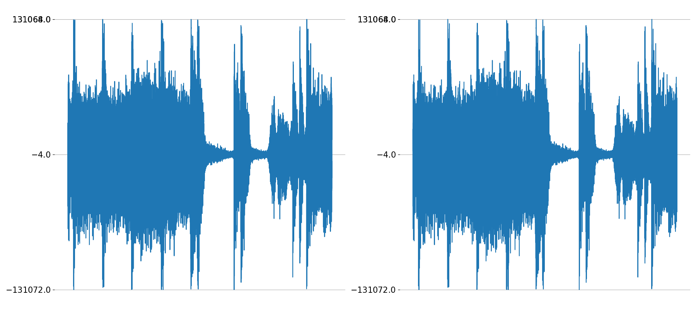
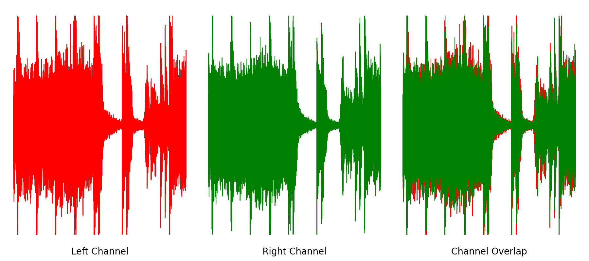
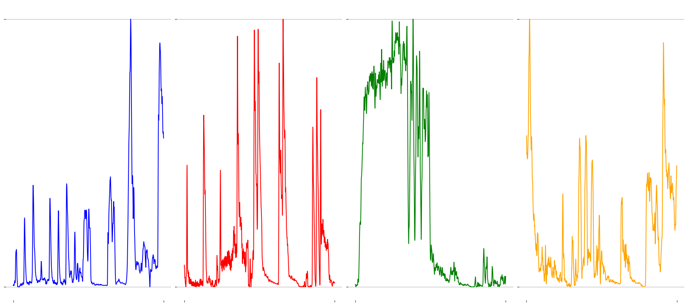

<!-- Py-Config header -->
<head>
<py-config hidden src="pyconfig.toml">
[[fetch]]
files = ["./audio1.py"]
</py-config>
</head>

<!-- Content -->

# Introduction

Words words words words

<audio controls>
<source alt="example" src="angel.wav" type="audio/wav">
</audio>

# Waveforms

**Sound** is the displacement of air particles over time. We can describe the displacement of air particles graphically as a **waveform**, which plots the displacement of particles (called *amplitude*) in terms of time $t$. Take, for example, a simple sine function $f(t) = \alpha\cdot \sin(t)$, where $\sin(t)$ *oscillates* (moves in a constant range indefinitely), and $\alpha$ is a constant defining the upper and lower bounds of the function's amplitude. Below, I've plotted one complete **wavelength** (the length of one complete cycle), four complete cycles, and a much larger number of cycles. 

Although all sounds can be defined as a collection of sine waves, the human ear doesn't *hear* the individual **samples**, or cycles of a oscillating function. Instead, samples are played at such a high rate that the human ear can't audibly pinpoint specific samples. Instead, the samples combine the into one cohesive sound. Standards for **sample rate**, or the number of samples played per second in **Hertz (Hz)**, can range from 44,100 Hz to nearly 192,000 Hz in professional studios.

If human hearing only spans the range of 20 Hz - 20,000 Hz, why do we use much higher sample rates? The answer is that, in order to process an audio signal without losing information, we need need to use a sample rate that is at least twice as big as the highest frequency sound in the signal. This is known as the **Nyquist Limit**, and is the reason signals typically use a sample rate in the 40 kHz range. And while human hearing isn't capable of capturing anything beyond this range, music producers often use even higher sample rates as a means of capturing higher-resolution audio.

# Basic Waves and Sounds

All audio signals can be described as some manipulation of sine waves, through the processes of **additive and subtractive synthesis.** Essentially, this allows us to create whatever sounds we like by combining and manipulating simple sines waves to form much more complex sounds. Here's a plot of a couple of frames versus a much larger snippet of "Stay With Me" by Miki Matsubara.

<audio controls>
<source alt="Miki Matsubara - Stay With Me" src="staywithme.wav" type="audio/wav">
</audio>

From here, we can introduce more concepts related to audio signals. For example, sound can depend on the **number of channels** used to output an audio signal. You're likely used to hearing **stereophonic sound**, where a left and right channel output specific audio signals to the left and right side of a listening body. 

This allows for some neat tricks, such as hearing something coming from one side of you and not another. In a similar vain, **monophonic sound** uses one channel for all audio, meaning that you'll hear the same sound across all speakers, even if you're wearing a pair of headphones or sitting in a multi-channel studio. 

# References

- Words

- Words

- Words