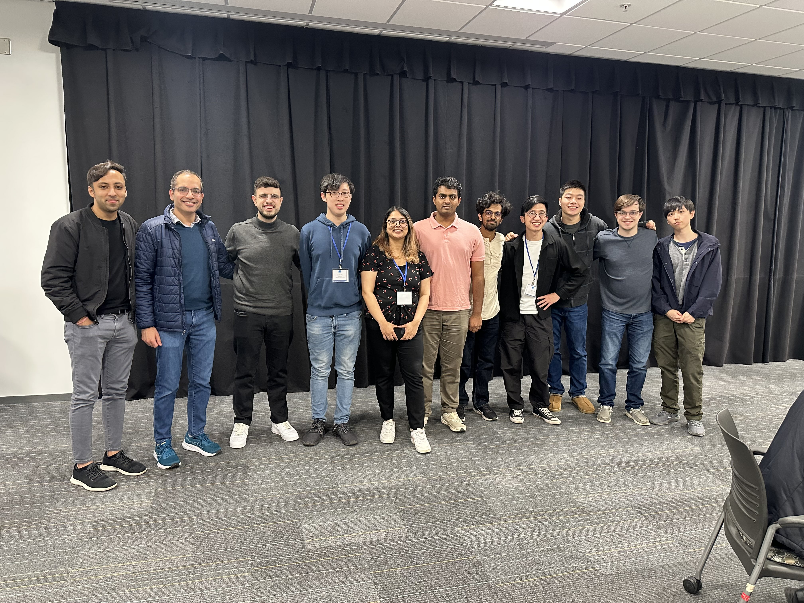

# CSLSC 2025

I'm proud to announce that [CSLSC 2025](https://studentconference.csl.illinois.edu/) was a resounding success! This year, I chaired for the Machine Learning and Signal Processing (MLSP) session alongside [Asher Mai](https://hanlinmai.web.illinois.edu/). Guest speakers included Dr. [Cem Subakan](https://ycemsubakan.github.io/) from Université Laval, and [Ziyang Chen](https://ificl.github.io/) from the University of Michigan.
We also had a handful of student presenters, of which included [Trung-Hieu Hoang](https://hthieu.web.illinois.edu/) who won "best MLSP student talk." Thank you to everyone who presented and helped in the organization process for the conference, we couldn't have done this without you.

